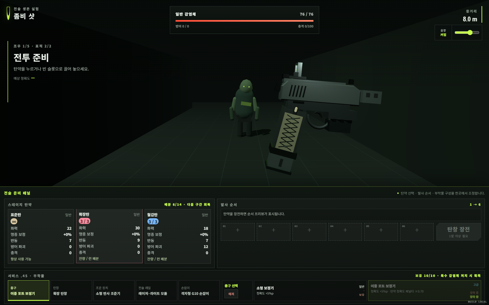
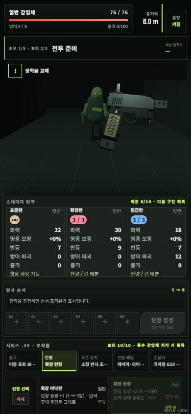
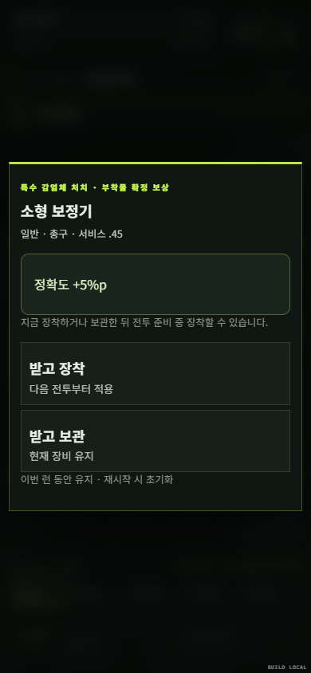

# 서비스 .45 부착물 v1

## 구현 범위

이 저장소는 Unity가 아닌 TypeScript·Vite·Three.js 브라우저 게임이다. 가상 서비스 권총의 내부 이름은 `Service .45`, 화면 이름은 `서비스 .45`다. 금속 슬라이드, 싱글 스택 느낌의 좁은 손잡이, 노출 해머와 하부 레일을 가진 절차적 저폴리 모델로 구현했다. 실물 브랜드·상표 각인은 없다. Unity 프리팹이나 외부 바이너리 모델은 생성하지 않았다.

기존 부착물 13종과 그 전용 피해·축적·충격·희귀탄 보존 수정자를 제거했다. 새 정의 10종 모두 실제 모델을 생성하며 가늠쇠·조준기는 슬라이드, 손잡이는 그립, 레이저는 하부 레일, 탄창 연장부는 실제로 움직이는 탄창에 붙는다. 슬롯 봉쇄는 효과만 끄며 부품은 사라지지 않는다. 총구 효과는 보정기 끝에서 발생한다.

## 확정 수치

기본 탄창 4발, 일반 탄창 5발, 고급 탄창 6발. 최대 6발이며 한 발 이상이면 발사한다. 탄창 교체는 특수탄 휴대 용량 14발, 런 탄약 배분, 스테이지 잔량을 바꾸지 않는다. 용량 축소로 밀려난 장전 예약도 소비하지 않는다.

| 슬롯 | 일반 | 효과 | 고급 | 효과 |
|---|---|---|---|---|
| 총구 | 소형 보정기 | 정확도 +1 | 이중 포트 보정기 | 정확도 +1, 탄약 반동/음수 정확도 1 감소 |
| 탄창 | 확장 바닥판 | 탄창 +1발 | 확장 탄창 | 탄창 +2발 |
| 조준 장치 | 고시인성 가늠쇠 | 정확도 +1 | 소형 반사 조준기 | 정확도 +1, 중거리 화력 페널티 1 감소 |
| 전술 레일 | 소형 레이저 조준기 | 근거리 정확도 +1 | 레이저·라이트 모듈 | 근거리 +1, 가장 가까운 유효 표적 +1 |
| 손잡이 | 고무 손잡이 | 정확도 +1 | 격자형 G10 손잡이 | 탄약 반동/음수 정확도 1 감소 |

정확도는 명중 확률이 아닌 최종 화력에 그대로 더하는 정수다. 서비스 .45의 기본 화력은 2, 기본 정확도는 0, 거리 페널티는 근거리 0·중거리 1·원거리 2다. 유효한 사격의 최종 화력은 최소 1이다.

탄약에서 비롯한 음수 정확도와 양수 반동에만 페널티 감소를 적용한다. 이중 포트 보정기와 G10 손잡이를 함께 장착하면 각각 1씩, 합계 2를 줄인다. 음수 정확도는 0까지만 줄이고 양수 정확도는 줄이지 않는다. 반동은 발생 시 한 번만 경감하며 이미 누적한 반동을 다시 경감하지 않는다. 적의 지반 충격 -2도 경감하지 않는다.

거리 시스템은 정확도와 별도의 정수 페널티를 사용한다. 반사 조준기는 실제 중거리 페널티 1을 제거한다. 초음파로 중거리 표적이 유효 원거리로 악화되면 원거리 페널티 2에서 반사 조준기 감소 1을 뺀 최종 페널티 1을 적용한다. 별도 거리 배율은 없다.

현재 적은 한 번에 하나만 활성화되므로 살아 있는 현재 표적이 가장 가깝다. 다중 표적 확장을 위한 `CombatContext.targets`와 `isNearestValidTarget`은 죽은 표적·음수 거리를 제외하며 동일 최단 거리의 표적은 모두 인정한다. 뒤에 대기하는 조우 편성은 활성 표적에 포함하지 않는다.

## 보상과 소유권

런 시작 시 소유·장착 부착물은 없다. 특수 분류인 오염 투척체·지반 파쇄체·공명 비명체를 처치하면 즉시 `ATTACHMENT_REWARD`로 진입한다. 직접 사격과 화상 처치 모두 동일 경로를 사용한다.

호환 풀에서 이미 소유한 항목을 먼저 제거하고 일반 70·고급 30·희귀 0·영웅 0의 가중치로 등급을 추첨한다. 해당 등급이 소진되면 남은 다른 등급으로 대체한다. 전체 10종이 소진되면 수집 완료를 알리고 중복 없이 진행한다. 미래 희귀·영웅 콘텐츠는 정의·등급 가중치·호환 무기 목록을 확장하면 같은 보상 경로를 사용할 수 있다.

보상 화면은 이름·등급·슬롯·효과·교체될 부착물을 표시한다. ‘받고 장착’ 또는 ‘받고 보관’을 선택할 때 소유권을 추가한다. 슬롯당 하나만 장착하며 교체·해제는 기존 항목을 보관함에 남긴다. 소유권은 구간 이동 동안 유지되고 재시작 시 초기화된다. 보상 수령 중 중복 클릭은 차단한다. 진행 저장은 기존 게임과 마찬가지로 지원하지 않는다.

## 검증

- 자동 테스트: 전체 17개 파일, 138개 통과. 카탈로그 10종/5슬롯/4등급, 70:30 경계, 소진 등급 대체, 중복 방지, 미소유 장착 거부, 교체·해제·재시작.
- 전투 수치: 4/5/6발과 최대 6발, 휴대 용량 불변, 정수 가산 정확도, 탄약 페널티 감소 중첩, 적 방해 보존, 근·중·원거리, 최근접 표적, 모든 슬롯 봉쇄.
- 실제 게임 흐름 테스트: 특수 적 3종의 1발 처치, 화상 처치, 중복 수령 방지, 다음 표적 및 구간 탄약 보상 연결, 전체 카탈로그 소진.
- 렌더링: Edge 기반 브라우저 1440×900과 390×844에서 기본/일반/고급 모델, 보상 팝업, 실제 장착·해제와 4/5/6발 UI 확인. 확장 탄창 6발 장전·사격 후 탄창 비움과 휴대 용량 14발 유지, 툴팁 이름·슬롯·등급·효과를 확인했다. 브라우저 실행 오류 0건. 특수 처치 경로 검증은 적 체력을 1로 만든 로컬 테스트 상태를 사용했다. 표시 진단은 일반 화면에서 숨겨져 있다.
- 로컬 환경에는 npm 실행 파일이 없어 동일한 package.json 명령을 Node로 직접 실행했다. PR과 Pages CI에서는 npm test, npm run lint, npm run build를 실행한다.
- 빌드의 기존 Three.js 포함 단일 청크 크기 경고는 남는다. 컴파일·린트 오류는 없다.

스크린샷의 전체 장착 상태는 모델 확인용 테스트 상태이며, 실제 새 런은 비어 있다. 모바일 실기기 터치·장기 난도 검증과 Unity 이식은 이번 범위에 포함하지 않는다.

## 주요 코드

- `src/data/attachmentDefinitions.ts`: 무기 기준값, 슬롯·등급·호환성과 10종 효과.
- `src/progression/AttachmentRewards.ts`: 중복 없는 등급 추첨.
- `src/entities/Player.ts`: 런 소유권과 탄창 용량 동기화.
- `src/combat/CombatResolver.ts`: 정수 정확도·탄약 반동·거리 페널티·최근접 계산.
- `src/core/Game.ts`: 특수 처치 보상과 수령 이후 전투 진행.
- `src/ui/GameUI.ts`: 보상 화면과 보유 장착 패널.
- `src/presentation/SceneModels.ts`: 권총과 10종 절차적 모델.

## 렌더링 기록

데스크톱 고급 부착물 전체 장착 시험 상태:

세로 화면의 탄창 교체 패널과 6발 최대 용량:

특수 처치 후 수령 전 보상 화면:

